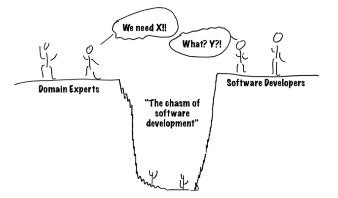

# 🇩.🇸.🇱 - (ArduinoML) 



## Team A

Members | Contact
----------------------------------------------------------- | ----------------------------------------------------------
[Anthony Barna](https://github.com/Anthony-Barna)           | [anthony.barna@etu.univ-cotedazur.fr](mailto:anthony.barna@etu.univ-cotedazur.fr)
[Leo Burette](https://github.com/LeoBurette)                | [leo.burette@etu.univ-cotedazur.fr](mailto:leo.burette@etu.univ-cotedazur.fr)
[Lara Defendini](https://github.com/Laradefendini)          | [lara.defendini@etu.univ-cotedazur.fr](mailto:lara.defendini@etu.univ-cotedazur.fr)
[Guillaume Savornin](https://github.com/GuillaumeSavornin)  | [guillaume.savornin@etu.univ-cotedazur.fr](mailto:guillaume.savornin@etu.univ-cotedazur.fr)
[Anton van der Tuijn](https://github.com/Anton-vanderTuijn) | [anton.van-der-tuijn@etu.univ-cotedazur.fr](mailto:anton.van-der-tuijn@etu.univ-cotedazur.fr)


## Project structure

- The ```external``` directory contains an approach using MPS (more [here](#MPS))
- The ```internal``` directory contains an approach using Groovy (more [here](#Groovy))
- The ```document``` directory contains the subject and our report

## Syntax language
TBD

## How to use MPS <a name="MPS"></a>
TBD

### Requirements
- TBD

## How to use Groovy <a name="Groovy"></a>
TBD

### Requirements
- TBD

<!--
## Distribution of points (500)

Member | Points
----------------------------------------------------------- | ----------------------------------------------------------
[Anthony Barna](https://github.com/Anthony-Barna)           | 100
[Leo Burette](https://github.com/LeoBurette)                | 100
[Lara Defendini](https://github.com/Laradefendini)          | 100
[Guillaume Savornin](https://github.com/GuillaumeSavornin)  | 100
[Anton van der Tuijn](https://github.com/Anton-vanderTuijn) | 100
-->


 
