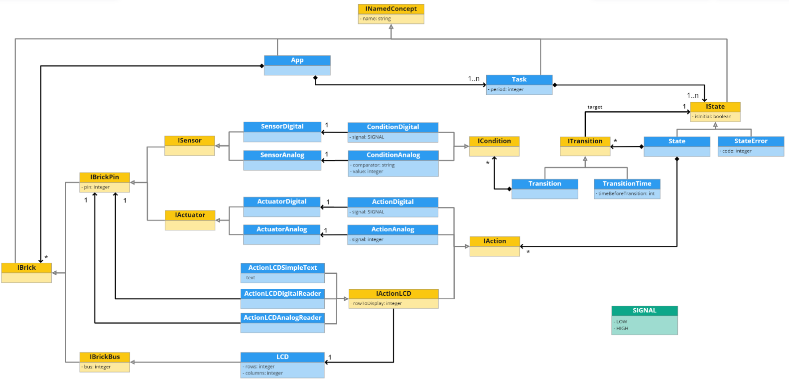

# 🇩.🇸.🇱 - (ArduinoML)


## Team ADSL2

Members | Contact
----------------------------------------------------------- | ----------------------------------------------------------
[Anthony Barna](https://github.com/Anthony-Barna)           | [anthony.barna@etu.univ-cotedazur.fr](mailto:anthony.barna@etu.univ-cotedazur.fr)
[Leo Burette](https://github.com/LeoBurette)                | [leo.burette@etu.univ-cotedazur.fr](mailto:leo.burette@etu.univ-cotedazur.fr)
[Lara Defendini](https://github.com/Laradefendini)          | [lara.defendini@etu.univ-cotedazur.fr](mailto:lara.defendini@etu.univ-cotedazur.fr)
[Guillaume Savornin](https://github.com/GuillaumeSavornin)  | [guillaume.savornin@etu.univ-cotedazur.fr](mailto:guillaume.savornin@etu.univ-cotedazur.fr)
[Anton van der Tuijn](https://github.com/Anton-vanderTuijn) | [anton.van-der-tuijn@etu.univ-cotedazur.fr](mailto:anton.van-der-tuijn@etu.univ-cotedazur.fr)

## Project structure

- The ```external``` directory contains an approach using MPS (more [here](#MPS))
- The ```internal``` directory contains an approach using Groovy (more [here](#Groovy))
- The ```document``` directory contains the subject and our report
- We standardize the Arduino sensor and actuators connection used (more [here](#Arduino))

---

## Domain model represented as a class diagram



## External DSL: MPS <a name="MPS"></a>

TBD: how to run

### Syntax (Extended Backus–Naur form)

```java

Brick = 
    (("Sensor Digital" | "Sensor Analog" | "Actuator Digital" | "Actuator Analog") String "on pin" Integer)
    | ("LCD" String "(" Integer "cols," Integer "rows ) on bus" Integer);

Task =
    "Task" String ":"
        "Period :" Integer "ms"
        (State)+
        (StateError)*;
       
State =
    "State" String ":"
        "initial :" Boolean
        "actions :" (Action)*
        "transitions :" (Transition)*;
       
StateError = 
    "Error State" String ": error code:" Integer;

Action = 
    (String "becomes" (Integer | Signal))
    | ("print" ((String "value") |  ("'" String "'")) "on" String "row n°" Integer);

Transition = 
    "to" String (("when" String (("becomes" Signal) | (("=="|"!="|">="|"<="|">"|"<") Integer))) | ("after" Integer "ms"));
    
Signal = 
    "high" | "low";

App =
    "Application" String
    (Brick)*
    (Task)+;
```
<!---
// TODO Remove once figured out the best way to display the transitions
Transition = 
      "to" String "when" String "becomes" Signal
    | "to" String "when" String ("=="|"!="|">="|"<="|">"|"<") Integer
    | "to" String "after" Integer "ms";
    
 Transition = 
      "to" String "when" String ("becomes" Signal) | (("=="|"!="|">="|"<="|">"|"<") Integer)
    | "to" String "after" Integer "ms";
 -->

#### Table of symbols

Notation | Usage
------------------ | ---------------- 
=                  | definition
;                  | termination
&#124;             | alternation
( ... )            | grouping
" ... "            | terminal string
' ... '            | terminal string
(* ... *)          | comment
( ... )*           | zero or more
( ... )+           | one or more
( ... )?           | zero or one

#### Syntax example

```java
Application Dual-check alarm

  Actuator Digital buzzer on pin 8
  Sensor Digital btn1 on pin 9
  Sensor Digital btn2 on pin 10

  Task program :
    Period : 1 ms
    State alarm_off :
      initial : true
      actions :
        buzzer becomes low
      transitions :
        to alarm_on when btn1 becomes high and
                         btn1 becomes high

    State alarm_on :
      actions :
        buzzer becomes high
      transitions :
        to alarm_off when btn1 becomes low
        to alarm_off when btn2 becomes low
```

### Scenarios supported

Basic scenarios:

- [X] Very simple alarm
- [X] Dual-check alarm
- [X] State-based alarm
- [X] Multi-state alarm

“A la carte” features:

- [X] Exception Throwing
- [X] Temporal transitions
- [X] Supporting the LCD screen
- [X] Handling Analogical Bricks
- [X] Parallel periodic Region

### Requirements

- [MPS](https://www.jetbrains.com/mps/)

## Internal DSL: Groovy <a name="Groovy"></a>

To run the project move into the internal directory which contain the Groovy implementation </br>
First you must run ```build.sh``` to build the project. </br>
Then in the GroovuinoML folder you can launch a script using ```run.sh```. </br>

> example: ./run.sh scripts/base/VerySimpleAlarm.groovy </br>

The scenarios emplemented can be found under ```./scripts/base``` and ```./scripts/extensions```. </br>
The script code for the arduino will be outputed in the ```program.ino``` file. </br>

### Syntax (Extended Backus–Naur form)

```java

Brick =
    (("sensorDigital" | "sensorAnalog" | "actuatorDigital" | "actuatorAnalog") String "pin" Integer) 
        | ("lcd" String "cols" Integer "rows" Integer "onBus" Integer);

Task =
    "task" "{"
        "taskName" String
        "period" Integer
        (State)+
        (StateError)*
    "}";

State =
    "state" "{"
        "name" String
        "initial" String
        "actions" "{"
            (Action)*
        "}";
        "transitions" "{"
            (ToState)+
        "}";
    "}";

StateError =
    "stateError" "{"
        "name" String
        "code" Integer
    "}";

Action =
    ("actionDigital" String "becomes" Signal | "actionAnalog" String "becomes" Integer) 
        | (("printText" | "printDigital" | "printAnalog") String "valueOn" String "row" Integer);

ToState =
    "toState" String "when" Condition ("and" Condition)*;

Condition =
        String (("becomes" Signal) | (("==" | "!=" | ">=" | "<=" | ">" | "<") Integer))

Signal =
    "high" | "low";

Application =
    "application" String;

Grammar =
    (Brick)*
    (Task)+
    Application;
```

#### Table of symbols

Notation | Usage
------------------ | ---------------- 
=                  | definition
;                  | termination
&#124;             | alternation
( ... )            | grouping
" ... "            | terminal string
' ... '            | terminal string
(* ... *)          | comment
( ... )*           | zero or more
( ... )+           | one or more
( ... )?           | zero or one

#### Syntax example

```groovy
sensorDigital "button" pin 9
actuatorDigital "led" pin 12
actuatorDigital "buzzer" pin 11

task {
    taskName "task"
    period 1000

    state {
        name "on"
        initial "false"
        actions {
            actionDigital "led" becomes "high"
            actionDigital "buzzer" becomes "high"
        }
        transitions {
            toState "off" when "button" becomes "low"
        }
    }

    state {
        name "off"
        initial "true"
        actions {
            actionDigital "led" becomes "low"
            actionDigital "buzzer" becomes "low"
        }
        transitions {
            toState "on" when "button" becomes "high"
        }
    }
}

application "Very Simple Alarm"
```

### Scenarios supported

Basic scenarios:

- [X] Very simple alarm
- [X] Dual-check alarm
- [X] State-based alarm
- [X] Multi-state alarm

“A la carte” features:

- [X] Exception Throwing
- [ ] Temporal transitions
- [X] Supporting the LCD screen
- [X] Handling Analogical Bricks
- [ ] Parallel periodic Region

### Requirements

- [Groovy](https://groovy-lang.org/)
- Maven
- Java 8

---

## Arduino sensor and actuators connection <a name="Arduino"></a>

The following table was used to define the sensor and actuators connection pins for all the scenarios implemented. Of
course, you can change the configuration to suit your needs

Component | Type | Pin(s)
------------------ | ---------------- | ---------------------------------
Button 1           | sensorDigital    | 9
Button 2           | sensorDigital    | 10
Buzzer             | actuatorDigital  | 11
Led 1              | actuatorDigital  | 12
Led 2              | actuatorDigital  | 13
Error Led          | actuatorDigital  | 8
Temperature sensor | sensorAnalogical | A1
LCD screen         | lcd              | 10, 11, 12, 13, 14, 15, 16 (bus2)*

*Lcd screen pins for bus 2 are hardcoded, so no need to give them

<!--
## Distribution of points (500)

Member | Points
----------------------------------------------------------- | ----------------------------------------------------------
[Anthony Barna](https://github.com/Anthony-Barna)           | X
[Leo Burette](https://github.com/LeoBurette)                | X
[Lara Defendini](https://github.com/Laradefendini)          | X
[Guillaume Savornin](https://github.com/GuillaumeSavornin)  | X
[Anton van der Tuijn](https://github.com/Anton-vanderTuijn) | X
-->

---


 
